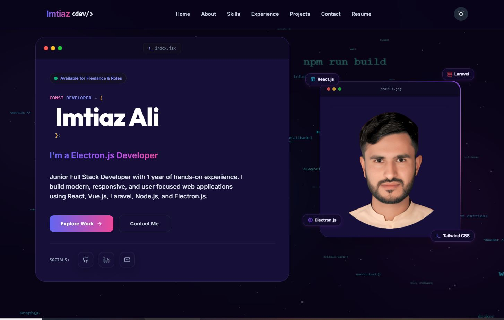

# Imtiaz Ali — Full Stack Developer Portfolio

<div align="center">
  

  <p align="center">
    <strong>A Premium Cyber-Noir & Space-Glow Responsive Developer Portfolio</strong>
  </p>

  <p align="center">
    <a href="https://react.dev/"></a>
    <a href="https://vite.dev/"></a>
    <a href="https://tailwindcss.com/"></a>
    <a href="https://threejs.org/"></a>
    <a href="https://www.framer.com/motion/"></a>
  </p>
</div>

---

## 🌌 Overview

Welcome to the official repository of **Imtiaz Ali's Developer Portfolio**. This application is a high-performance single-page web app built on **React 19** and **Vite**, featuring a premium aesthetic influenced by glassmorphism, responsive grid alignments, and a parallax stellar starfield/code matrix background.

This portfolio is the **30th project** in Imtiaz Ali's collection, functioning as a central showcase for other frontend dashboard SaaS platforms, desktop utilities, and full-stack backend solutions.

---

## ✨ Features & Architecture

### 1. Dynamic Space Parallax Background
* **Parallax Starfield & Matrix Effects**: Powered by **Three.js** canvas components (`CodeWorldBackground` and `LightCodeWorldBackground`), rendering floating digital symbols and code elements that move based on client mouse movements.
* **Ambient glow nodes**: Background glows fade and color-shift to dynamically accent each page section.

2. **Bento Grid Showcase (Homepage Projects & Archives)**
   - Re-engineered project blocks in a premium Bento Grid structure.
   - Built custom Chrome Browser mockup wrappers to highlight actual screens.
   - Interactive live status rings and neon badges that blink based on category.

3. **Seamless Scroll & Section Routing**
   - **Centralized Scroll Logic**: Refactored transitions (`ScrollToTop.jsx`) to smoothly handle cross-page section scrolling (navigating back to `/` and landing on targets like `#experience` or `#about`).
   - Mobile menu collapse animations are synced with navigation coordinates, eliminating layout displacement.

4. **Premium Resume Hub**
   - Implemented an embedded browser-frame PDF preview viewer.
   - Redesigned skills tags with premium accessibility contrast, custom badges, and interactive hover mechanics.
   - Pulsing glowing timeline dots (`animate-ping`) showing career growth milestones.

5. **EmailJS Contact System**
   - Linked directly to a contact submission form.
   - Fully customizable through root environment configuration.
   - Embedded with success and rate-limit error feedback alerts.

---

## 🛠️ Technology Stack

* **Core Framework**: React 19 (Hooks, Context, state-driven theme wrappers)
* **Build System**: Vite (Fast HMR, optimized production chunks)
* **Styling Layer**: Tailwind CSS (Glassmorphism filters, grid layouts, custom transition utilities)
* **Motion & Anim**: Framer Motion (Scroll triggers, scale offsets, entry transitions)
* **Graphics Engines**: Three.js (Dynamic WebGL canvas renderers)
* **Icon Set**: React Icons / Feather Icons (`react-icons/fi`, `react-icons/fa`)

---

## 📦 Project Structure

```text
├── public/                 # Static assets (Favicons, PDF resume)
│   ├── resume/
│   │   └── resume.pdf      # Downloadable PDF Resume
│   └── images/             # Profile and Project Screenshot assets
├── src/
│   ├── components/         # Reusable Component Modules
│   │   ├── common/         # Layout nodes (Navbar, Footer, ScrollToTop)
│   │   ├── home/           # Homepage Sections (Hero, About, Contact, etc.)
│   │   └── ui/             # Core UI components (Buttons, ProjectCards)
│   ├── data/               # Local JSON Data files (projects, experience, skills)
│   ├── context/            # React Theme and global state providers
│   ├── pages/              # Routing Entry Pages (Home, Projects, ProjectDetails)
│   ├── styles/             # Stylesheets (globals.css, Tailwind definitions)
│   ├── App.jsx             # Core Application Bootstrap
│   └── main.jsx            # DOM entry mount point
├── .env                    # Local environment variables configuration (Ignored by git)
├── vite.config.js          # Vite Bundler configurations
└── tailwind.config.js      # Tailwind theme tokens and configurations
```

---

## 🚀 Getting Started

Follow these steps to run the portfolio on your local machine:

### 1. Clone the repository
```bash
git clone https://github.com/Imtiaz-Ali17314/my-portfolio.git
cd my-portfolio
```

### 2. Install dependencies
```bash
npm install
```

### 3. Setup environment variables
Create a `.env` file in the root directory:
```env
VITE_EMAILJS_SERVICE_ID=your_emailjs_service_id_here
VITE_EMAILJS_TEMPLATE_ID=your_emailjs_template_id_here
VITE_EMAILJS_PUBLIC_KEY=your_emailjs_public_key_here
```
*(See `.env` comments for instructions on setting up EmailJS to link to your email).*

### 4. Run developer server
```bash
npm run dev
```
Open [http://localhost:5173](http://localhost:5173) in your browser.

### 5. Build for production
```bash
npm run build
```
The optimized bundle will be compiled under `/dist`.

---

## 📜 License
Distributed under the MIT License. See `LICENSE` for more information.

---

<div align="center">
  <p>Built with ❤️ by Imtiaz Ali &copy; 2026</p>
</div>
